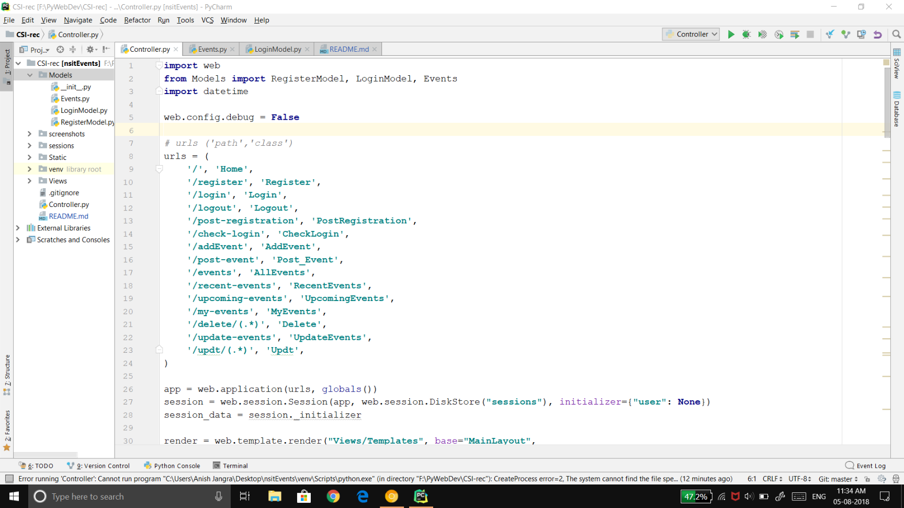
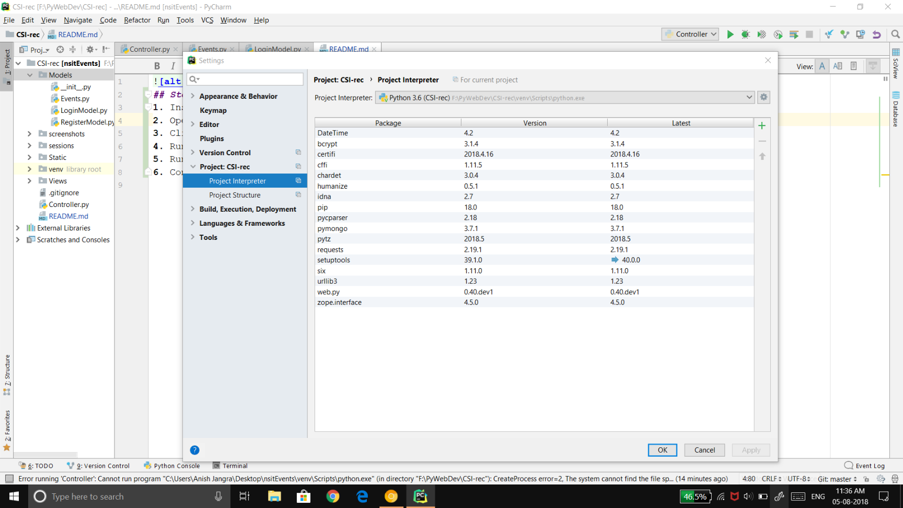
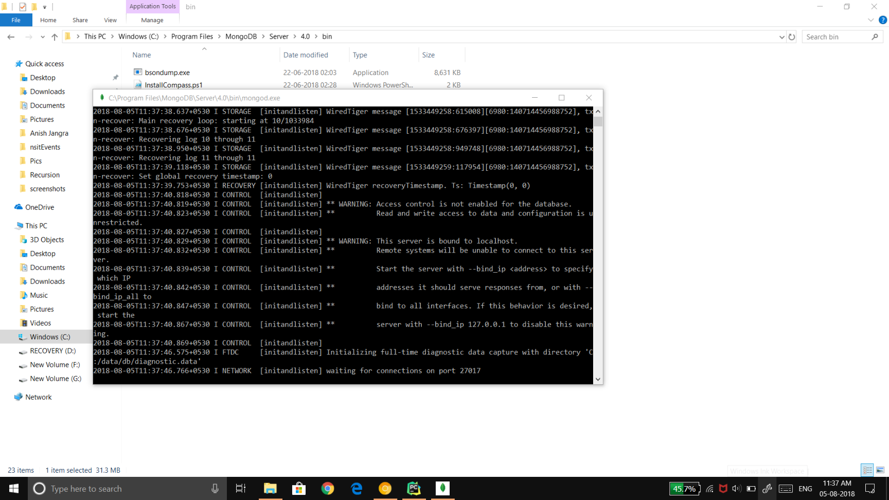
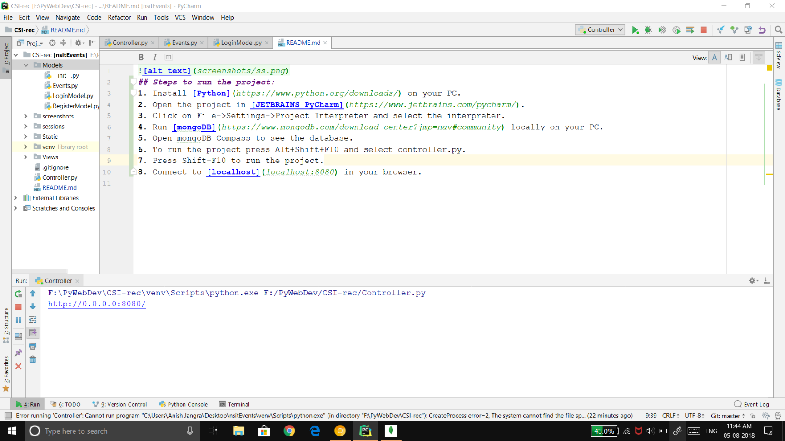

## Steps to run the project:
1. Install [Python](https://www.python.org/downloads/) on your PC.
2. Open the project in [JETBRAINS PyCharm](https://www.jetbrains.com/pycharm/).
    
3. Click on File->Settings->Project Interpreter and select the interpreter.
    
4. Run [mongoDB](https://www.mongodb.com/download-center?jmp=nav#community) locally on your PC.
    
5. Open mongoDB Compass to see the database.
6. To run the project press Alt+Shift+F10 and select controller.py.
7. Press Shift+F10 to run the project.
    
8. Connect to the [localhost](localhost:8080) in your browser.
